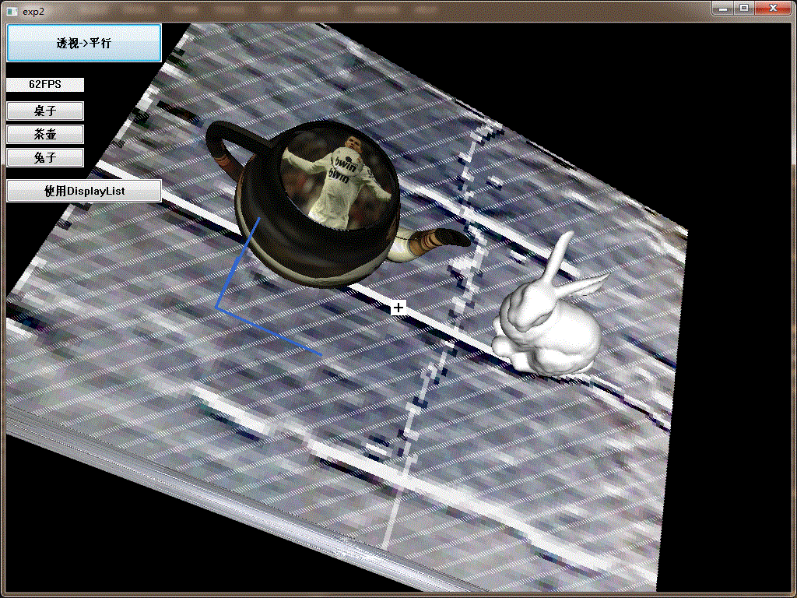

## CHEN BO YAN
   
   陈博言
  
   
   
   
   
   
   Student number：201405301322
   
   School:Shandong university
   
   Department:Computer Science And Technology
   
   Focus on:information security
   
   Hobby:soccer,listening to music,reading
   
   Mail: 1070305323@qq.com 
   

### My view towards computer graphics
   This is my home page of the Computer Graphics(CG) and this is also the first assignment.Important topics in computer graphics include user interface design, sprite graphics, vector graphics, 3D modeling, shaders, GPU design, implicit surface visualization with ray tracing, and computer vision, among others. The overall methodology depends heavily on the underlying sciences of geometry, optics, and physics.So you may use your creativity in this course.

   The unprecedented development broden the field of CG,VR and AR set up a new approach to information, and screens became thinner and cheaper, put into pockets and in every corner. Cameras are embedded into mobile phones, cars and glasses, supporting video capture and even direct 3D modeling. Moreover, the performance of the video cards have been growing rapidly, cards catering for the calculation of more complex effects.

### Links
This is [SDU IRC](http://irc.cs.sdu.edu.cn) 

This is [Home page of CG course]( http://www.cs.sdu.edu.cn/~baoquan/course/S17_CG.html)

This is my good friend [dapeng Xu](https://dapeng-xu.github.io/)

Something interesting:[Top meeting of CG](http://www.siggraph.org/)

This is my rencent work of bcp cryptosystem,this is  an Additively Homomorphic Encryption which differs from traditional Paillier Homomorphic.It has two mechanisms of decryption.The most important issue is that there is no other codes in github and only one in other website using C++ with poor performance and only one way of decryption.It is writen by myself and the copyright is reserved by cby         [my bcp cryptosystem]( https://github.com/cby1996/bcp-homomophic-encryption)
### Project
### Assignment 2 
This is my projet2 [robot animation](https://github.com/cby1996/robot-animation) It is not very difficult so I finish and submit the project on 24/3 2017

And you can see the [video](http://video.tudou.com/v/XMjY3OTA1MTYyMA==) of my project2 from Todou

This is the document to explain how the code works [report](https://github.com/cby1996/robot-animation/tree/master)

### Assignment 3
This is my project3 [robot animation using shading model](https://github.com/cby1996/CG_project3),it is based on my project2.

And you can see the [video](http://video.tudou.com/v/XMjcxODMyODc4OA==.html?from=s1.8-1-1.2&spm=a2h0k.8191414.0.0) of my project3.

This is the document to explain how the code works [report](https://github.com/cby1996/CG_project3/blob/master/README.md).
### Assignment 4
This is my project4 [Interractive scene using texture mapping]((https://github.com/cby1996/Texture_mapping),it is based on texture mapping in OpenGL to dipict an interactive scene.
 
 
 In this scene,you can view from different angle and can change texture.
 
 
 
 you can see the demo [video](http://video.tudou.com/v/XMjc3ODYxNTg5Mg==.html?spm=a2h28.8313469.con1.dimg1) of this project.
 
 
 [edit](https://github.com/cby1996/cby1996cg.github.io/edit/master/index.md) 
